### When Are People On Balloon Race?
#### No more randomly checking and hoping people are on - here is the cold hard data

##### Checks every 5 minutes, charts update every day (times in Mountain Time)

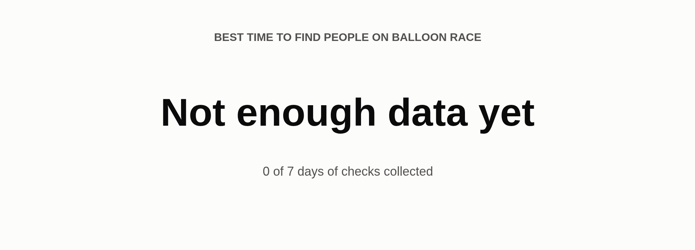

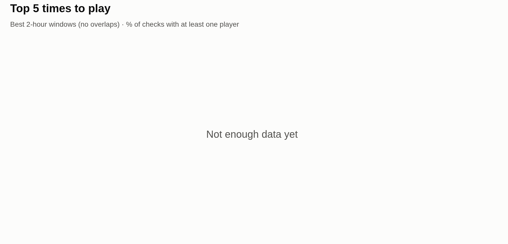

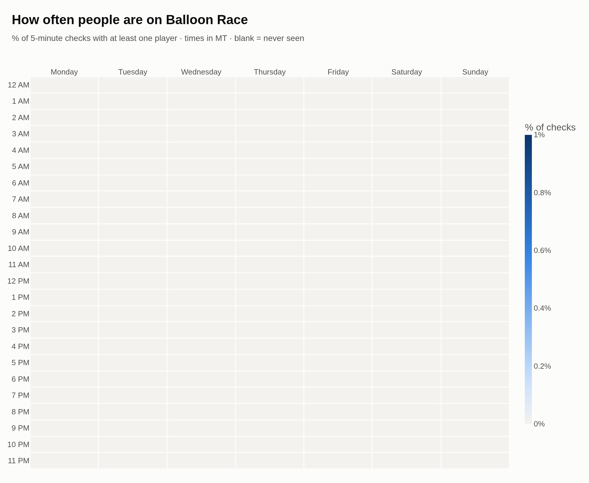

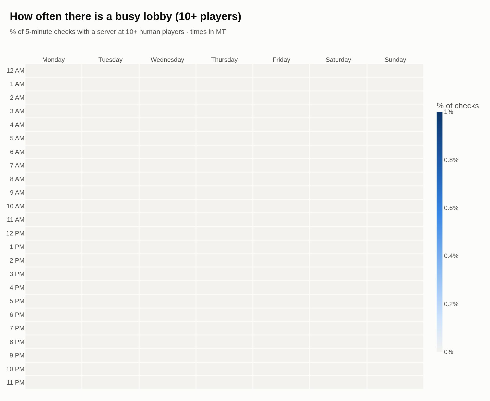

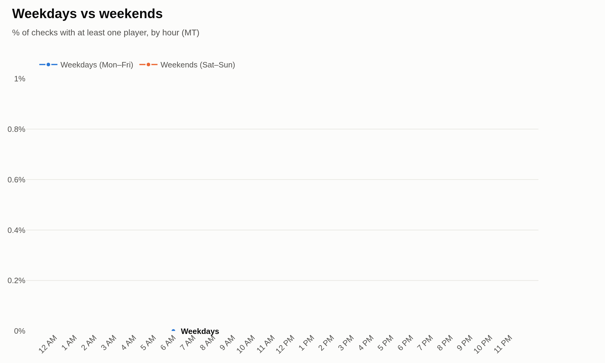

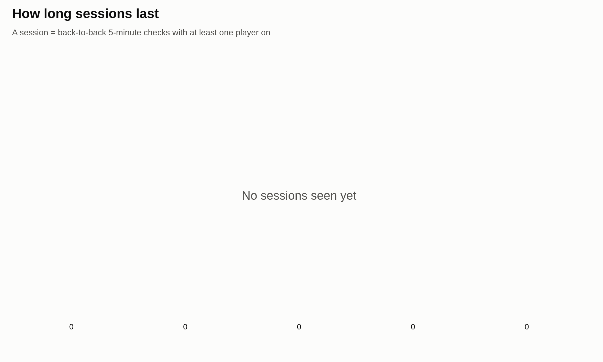

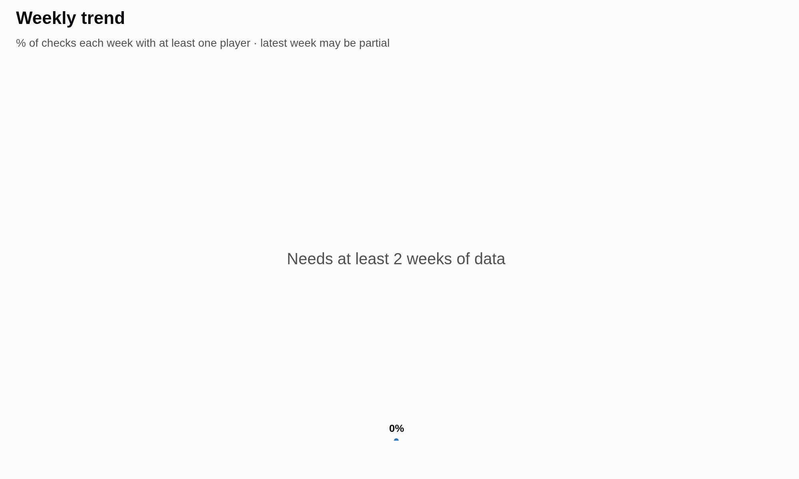

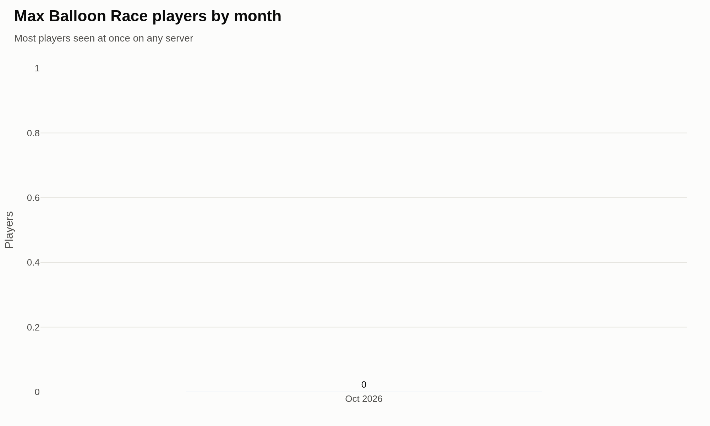

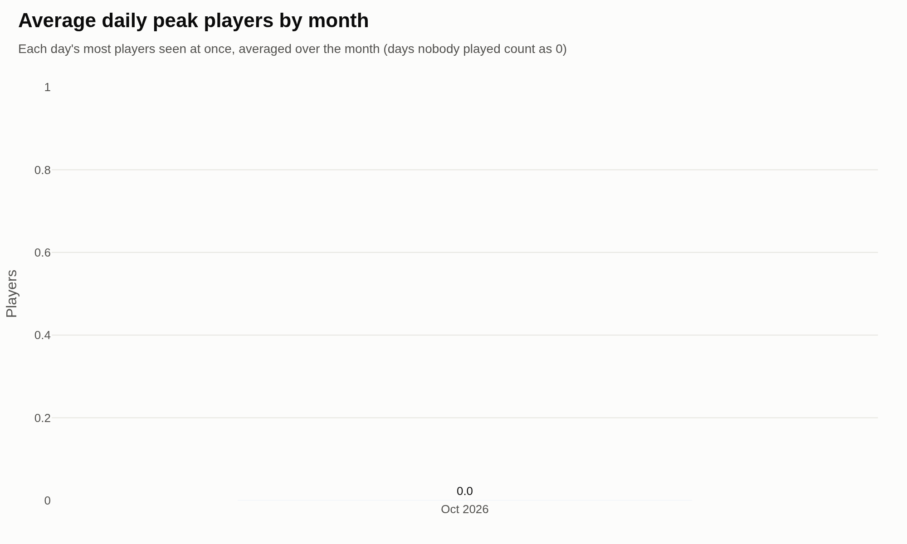

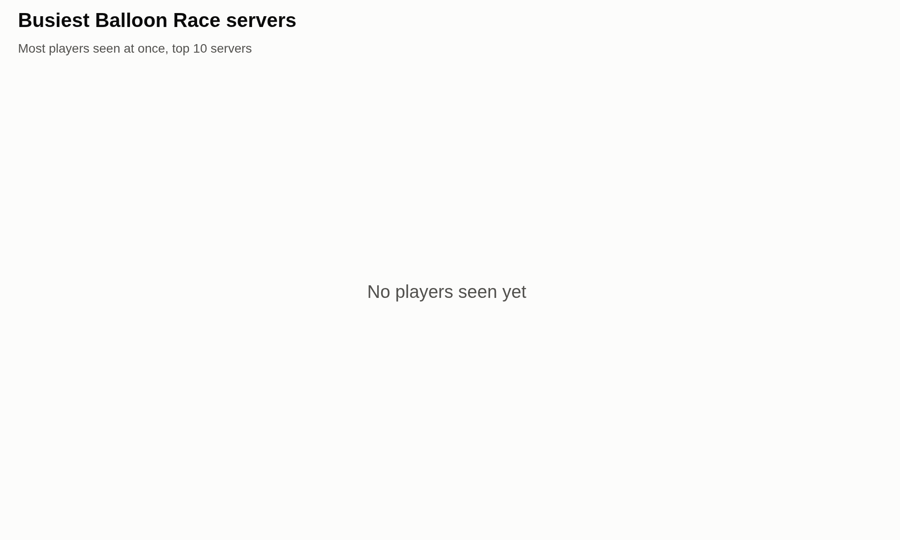

### Top 5 Balloon Race servers

Ranked by how often they have people on. Favorite these so they're one click away.

<!-- TOP_SERVERS_START -->
_No server data yet - check back after a few days._
<!-- TOP_SERVERS_END -->

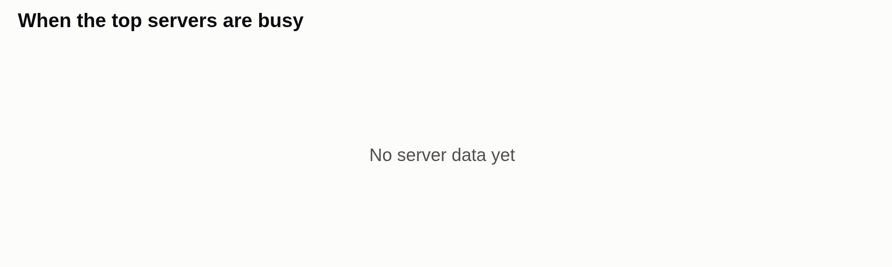

---

### How it works

- `main.py` runs every 5 minutes. It asks the Steam API which TF2 servers are on `balloon_race_v2b`, logs every server with human players (bots excluded) to `tf2_balloon_log.txt`, and emails you when a server has more than `MIN_PLAYER_THRESHOLD` players (max `EMAIL_SEND_LIMIT` emails a day).
- `generate_report.py` runs once a day. It turns the log into the charts above, rewrites the top servers table, and pushes the charts, README and log to GitHub. The log lives in the repo so the history is never lost.

### First-time setup

**1. Install**

```bash
git clone git@github.com:benbav/tf2_balloon_race_emailer.git
cd tf2_balloon_race_emailer
python3 -m venv .venv
.venv/bin/pip install -r requirements.txt
.venv/bin/plotly_get_chrome   # headless Chrome that plotly uses to save the chart PNGs
```

**2. Create a `.env` file** in the project folder (it's gitignored, never commit it):

```bash
# Steam Web API key
steam_api_key=

# Gmail account the alerts are sent FROM
from_email=

# Gmail App Password for from_email (not your normal password)
email_app_pass=

# Comma-separated recipients, no spaces: a@x.com,b@y.com
to_email=
```

Where to get each value:

| Key | Where to get it |
|---|---|
| `steam_api_key` | Sign in at https://steamcommunity.com/dev/apikey, enter any domain name (e.g. `localhost`), and copy the key. |
| `from_email` | Any Gmail address you want the alerts to come from. |
| `email_app_pass` | Turn on 2-Step Verification for that Google account, then create an app password at https://myaccount.google.com/apppasswords. Paste the 16 characters (spaces optional). |
| `to_email` | Whoever should get the alerts. Can be the same as `from_email`. |

**3. Test it**

```bash
.venv/bin/python main.py && tail tf2_balloon_log.txt
.venv/bin/python generate_report.py --no-push   # draws charts without pushing
```

**4. Schedule it** with `crontab -e` (cron runs in the server's clock, UTC here):

```cron
*/5 * * * * cd /path/to/tf2_balloon_race_emailer && .venv/bin/python main.py >> cron.log 2>&1
0 6 * * * cd /path/to/tf2_balloon_race_emailer && .venv/bin/python generate_report.py >> cron.log 2>&1
```

The daily report pushes to GitHub, so the repo remote needs to use SSH (`git remote set-url origin git@github.com:benbav/tf2_balloon_race_emailer.git`) with a key added to your GitHub account.

### Settings

- `main.py`: `EMAIL_SEND_LIMIT`, `MIN_PLAYER_THRESHOLD`
- `generate_report.py`: `DISPLAY_TIMEZONE` / `TZ_LABEL` (chart timezone), `LOG_TIMEZONE` (clock the log was written in), `MIN_DAYS_FOR_SCORECARD`, `SCORECARD_RECENT_DAYS`, `BUSY_THRESHOLD`, `TOP_SERVER_COUNT`
